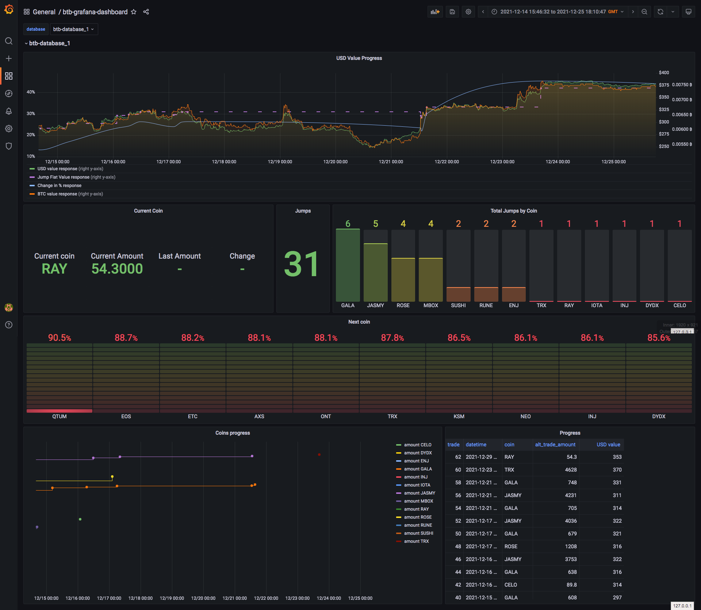

# btb-grafana-dashboard



Grafana dashboard for [Binance Trade Bot](https://github.com/MasaiasuOse/binance-trade-bot).

## Installation

**Prerequisites**: Docker and docker-compose.

1. Copy file `docker-compose.yml.example` to `docker-compose.yml`.
```bash
cp docker-compose.yml.example docker-compose.yml
```
2. Edit `.env` file with the following:
  - Line 1 and 2 change your credentials. For example:
```bash
GRAFANA_ADMIN_USER=admin
GRAFANA_ADMIN_PASSWORD=6783jdhf!
```

  - Line 3, port to use. For example:
```bash
GRAFANA_HTTP_PORT=42069
```

  - Relative path of your btb database. For example:
```bash
DB_PATH_1=../binance-trade-bot/data/crypto_trading.db
``` 

3. Run `docker-compose up -d` and go to [http://YOUR_PUBLIC_IP:YOUR_PORT](http://127.0.0.1:42069) in your browser.


## Multi-bots support

If you want to support more than one bot, you can do it by the following:

1. Edit `.env` file adding more database paths variables. For example:
```bash
DB_PATH_1=../btb-1/data/crypto_trading.db
DB_PATH_2=../btb-2/data/crypto_trading.db
DB_PATH_3=../btb-3/data/crypto_trading.db
```
2. Uncomment lines 10 and 11, or add lines on your `docker-compose.yml` to match the variables you just added in `.env`. **Note:** The variable names need to be the same here and in `.env` (see point 1 above). For example:
```bash
    volumes:
      - ${DB_PATH_1}:/app/database-1.db
      - ${DB_PATH_2}:/app/database-2.db
      - ${DB_PATH_3}:/app/database-3.db
```
3. Edit `grafana/datasource.yml` uncomment or add datasources. Property `path` inside `jsonData` should match the path in `docker-compose.yml` volumes (see point 2 above). 
**Note**: Don't forget to check that every datasource has its own unique `name` property. Your file should look something like this:

```yaml
apiVersion: 1
datasources:
  - name: btb-database_1
    type: frser-sqlite-datasource
    access: proxy
    isDefault: false
    editable: true
    jsonData:
      path: /app/database-1.db # Same path in docker-compose.yml volumes.

  - name: btb-database_2
    type: frser-sqlite-datasource
    access: proxy
    isDefault: false
    editable: true
    jsonData:
      path: /app/database-2.db # Same path in docker-compose.yml volumes.
      
  - name: btb-database_3
    type: frser-sqlite-datasource
    access: proxy
    isDefault: false
    editable: true
    jsonData:
      path: /app/database-3.db # Same path in docker-compose.yml volumes.
```

  
## Oracle Cloud (OCI)

If you're using an Oracle Cloud Instance, you'll need to open the selected port in your Oracle web GUI. Only reference I found is [this tutorial video](https://www.youtube.com/watch?v=cHIphTiYMpw).